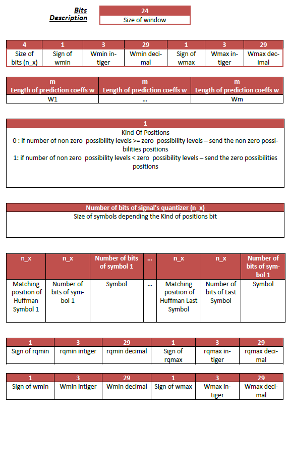

Loosy compression of wav files.
- Undersample signal
- Best linear predictor to quantize differences, not values.
- Uniform quantizer 
- Apply ADPCM
- Huffman encodig 

-Encoding using windows of data 

Use of a specific header that contains useful information for decoder.

HEADER bitstream

Decimpressing is the reverse precidure.
